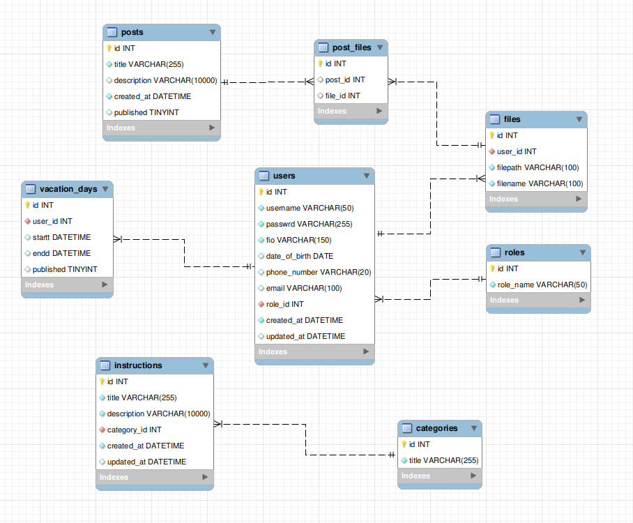
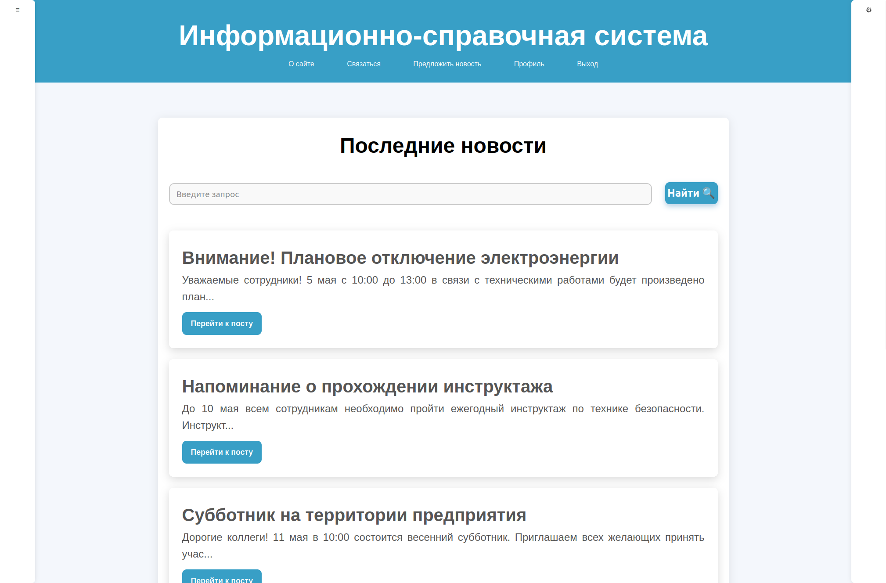
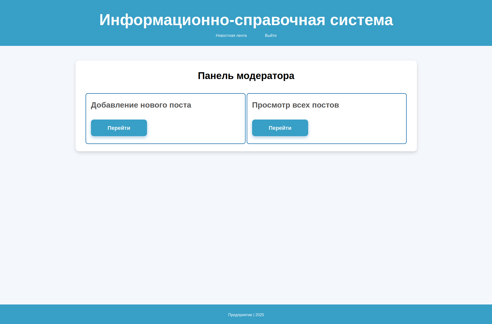
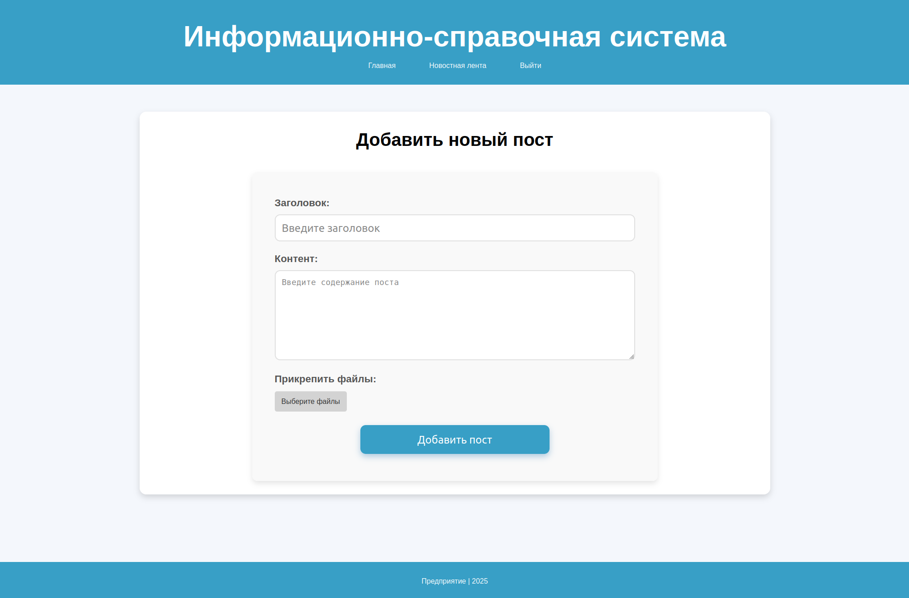
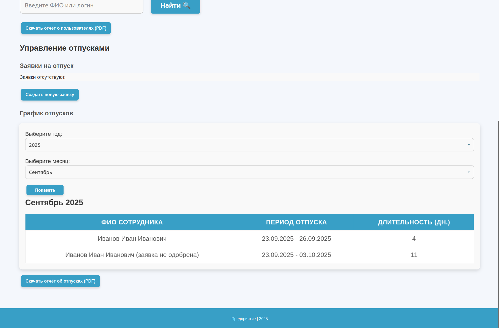

# Информационно-справочное веб-приложение для сотрудников "Предприятия"

Данный проект был выбран и реализован в качестве выпускной квалификационной работы в техникуме МГТУ МТКП им. Н.Э. Баумана. Защищен 19.06.2025. Проект обеспечивает информационную систему для сотрудников "Предприятия" для внутренних коммуникаций и ведения документооборота.
___
## Описание проекта

&emsp;В рамках дипломного проекта было необходимо разработать информационно-справочное веб-приложение для сотрудников "Предприятия".

&emsp;В отличие от обычного корпоративного сайта, веб-приложение предоставляет сотрудникам и администрации расширенные функциональные возможности, например, публикацию и просмотр актуальных новостей, управление инструкциями по выполнению работы, такими как политика конфиденциальности и политика безопасности, а также систему запросов и утверждения заявок на отпуск. Система позволяет автоматизировать процессы и обеспечивать удобный доступ к важной информации, а также предусматривает разграничение прав доступа пользователей.

&emsp;Разработка данного проекта направлена на упрощение документооборота, связанного с отпусками сотрудников и улучшение коммуникации внутри предприятия. Внедрение веб-приложения позволит создать единое пространство для работников, обеспечивая удобный доступ к актуальной информации в любое время.
Разрабатываемое веб-приложение предоставляет удобный функционал для сотрудников предприятия. В нем объединены функции управления инструкциями, публикациями и отпусками, что делает систему полезной как для работников, так и для администраторов.

&emsp;Актуальность дипломного проекта обусловлена необходимостью хранения и управления информацией предприятия, а также обеспечением конфиденциальности этой информации. Хранение документов в бумажном виде, может привести к потере данных и не обеспечивает в полной мере эффективное информирование сотрудников о процессах, происходящих на предприятии. Помимо этого, использование корпоративного сайта для информирования работников предприятия не обеспечивает конфиденциальности данных, а следовательно может приводить к утечке информации в руки недоброжелателей.
___
## Используемые технологии

* Python 3.10+
* Flask
* HTML
* CSS
* JavaScript
* Git
* Docker
* Docker-compose
___
## Функциональные возможности

* Авторизация и аутентификация пользователей
* Управление пользователями
* Просмотр, добавление, редактирование и удаление контента
* Управление заявками на отпуск
* Поддержка загрузки и скачивания файлов
___
## Структура базы данных

___
## Установка

### Для пользователей:

#### Предварительные требования:

* Docker версии 20.10+
* Docker Compose версии 1.29+

#### Минимальные системные требования:
* 2 GB оперативной памяти
* 10 GB свободного места на диске

### Шаги установки:

1.  Создайте и перейдите в директорию приложения:
    ```bash
    mkdir app
    cd app
    ```

2. Создайте файл docker-compose.yml
    ```bash
    nano docker-compose.yml
    ```

3. Вставьте в этот файл следующее содержимое:
    ```
   services:
      app:
        image: shachenkovan/diplom_project
        ports:
          - "5000:5000"
        depends_on:
          db:
            condition: service_healthy
        env_file:
          - .env
    
      db:
        image: mysql:8.0
        environment:
          MYSQL_ROOT_PASSWORD: ${MYSQL_ROOT_PASSWORD}
          MYSQL_DATABASE: ${MYSQL_DATABASE}
        volumes:
          - ./mysql-init/:/docker-entrypoint-initdb.d/
        healthcheck:
          test: ["CMD", "mysqladmin", "ping", "-h", "localhost"]
          interval: 5s
          timeout: 10s
          retries: 10
   ```

4. Создайте файл .env:
    ```bash
   nano .env
    ```

5. Вставьте в него следующее содержимое предварительно изменив данные на свои:
    ```
   MYSQL_ROOT_PASSWORD=your_password # изменить
   MYSQL_DATABASE=diplom_project
   SECRET_KEY=your_secret_key # изменить
   UPLOAD_FOLDER=static/uploads
   ```

6. Запустите приложение с помощью следующих команд:
    ```bash
   # Запуск контейнеров в фоновом режиме
    docker-compose up -d
    
    # Просмотр статуса запуска приложения и базы данных
    docker-compose ps
   ```
   
7. Перейдите по ссылке для использования приложения:
    ```
   http://localhost:5000
   ```

8. Основные команды для управления приложением:
    ```bash
        # Просмотр статуса сервисов
        docker-compose ps
        
        # Просмотр логов приложения
        docker-compose logs app
        
        # Просмотр логов базы данных
        docker-compose logs db
        
        # Остановка приложения
        docker-compose down
        
        # Перезапуск приложения
        docker-compose restart
        
        # Обновление до последней версии
        docker-compose pull
        docker-compose up -d
    ```
### Для разработчиков:

#### Предварительные требования:
* Python 3.10+
* Git
* Docker и Docker Compose (опционально, для контейнеризованной разработки)
* MySQL (локально или в Docker)

### Шаги установки:

1. Клонируйте репозиторий:
    ```bash
   git clone git@github.com:shachenkovan/diplom_project.git
   cd diplom_project
    ```

2. Активируйте виртуальное окружение:
    ```bash
    # Для Linux/Mac
    python -m venv venv
    source venv/bin/activate
    
    # Для Windows
    python -m venv venv
    venv\Scripts\activate
    ```

3. Установите зависимости:
    ```bash
    pip install -r requirements.txt
    ```
   
4. Создайте файл .env:
    ```bash
    nano .env
    ```
   
5. Содержимое файла должно быть следующим:
    ```bash
    MYSQL_ROOT_PASSWORD=your_password # изменить
    MYSQL_DATABASE=diplom_project # или название вашей базы
   
    # Для локальной MySQL
    MYSQL_HOST=localhost
    # или для Docker
    MYSQL_HOST=db
   
    SECRET_KEY=your_secret_key # изменить
    UPLOAD_FOLDER=static/uploads
    ```

6. Переименуйте файл config_example.py в example.py:
    ```bash
   mv config/config_example.py config/config.py
    ```
   
7. Соберите докер-образ:
    ```bash
   docker build -t shachenkovan/diplom_project:latest .
    ```

8. Запустите с помощью команды:
    ```bash
   docker compose up -d
    ```

9. Перейдите по ссылке для использования приложения:
    ```
    http://localhost:5000
    ```
___
## Использование

При авторизации с помощью учетной записи пользователя Вы попадете на новостную ленту. Можно просматривать новостную ленту, переходить к содержанию интересующих постов по нажатию на кнопку, а также просматривать рабочие инструкции при наведении на левый сайдбар. 
При наведении на правый сайдбар есть возможность просматривать и редактировать данные своего профиля, а также оставлять и просматривать заявки на отпуск.



При авторизации через учетную запись модератора осуществляется переход на главную страницу модератора.



При нажатии на кнопку можно попасть на страницу для добавления новых постов.



Или на страницу для управления всеми постами, на которой можно просмотреть, отредактировать, удалить или выложить в новостную ленту посты.


При авторизации с помощью учетной записи администратора происходит переход на страницу администратора, на которой есть доступ к управлению постами аналогично модератору, а также возможность управлять пользователями в системе и их отпусками.
Есть возможность генерации отчетов по пользователям, постам и отпускам в системе.


В нижней части страницы администратора располагается график отпусков за текущий месяц с возможностью просмотра отпусков за любой другой интересующий период.


___
## Учетные записи по умолчанию

Администратор:

    Логин: admin@example.com
    Пароль: admin12

Модератор:
  
    Логин: moderator@domain.com
    Пароль: moderator1

Пользователь:
  
    Логин: morozova1@mail.com
    Пароль: qwerty1
___
## Поддержка

Для вопросов по установке и использованию, а также с предложениями по исправлению или улучшению проекта обращайтесь:

    Email: nastya.nba888@example.com
    Telegram: @shachenkovan